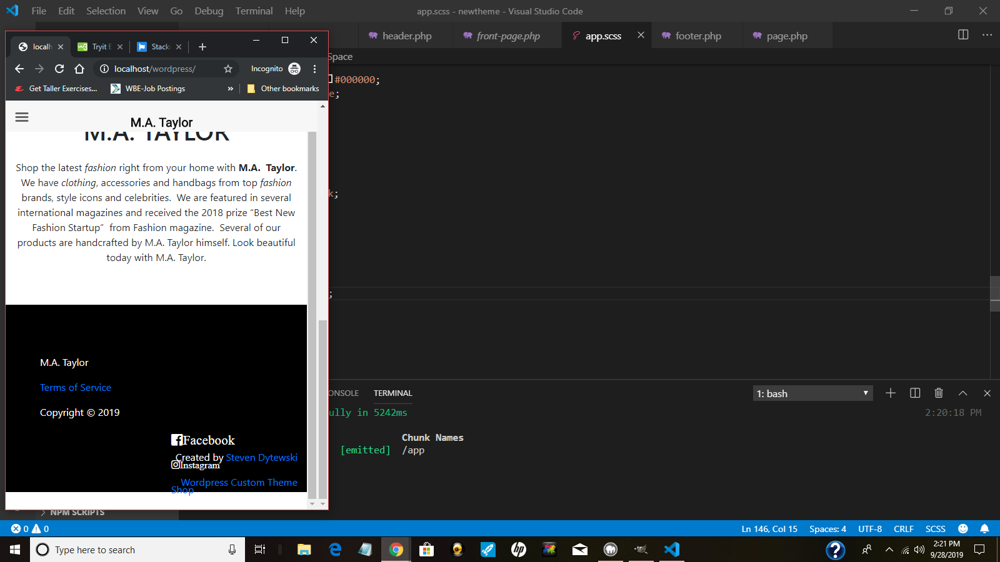

# customtheme
# MA Taylor 

In this application I created a custom Wordpress theme for an online shop.  This shop is for customers purchasing fashion items using WooCommerce as a plugin.  It demontstrates how I can integrate custom code with a CMS and third party plugins. The other important aspect of this project is the cart. There is also a cart where customers can fill out their information and receive confirmation that their product is shipped.

The project started by installing by wordpress and following an online tutorial on how to make a custom theme.  This is what I watched for guidance.  
https://www.youtube.com/watch?v=TlmDsU8GirU&t=3814s

However, I created my own styles and did not entirely follow the video. For instance, I used JavaScript to create a slideshow on the main page.

Technologies used:

Wordpress, WooCommerce, Custom Theme, HTML, CSS, Sass, Laravel, Webpack, Bootstrap, JavaScript, Node.JS, PHP

**Example 1** 

After Wordpress was installed on my localhost, I installed Node.js. I started first by setting up the files for a custom theme on my localhost. The tutorial I used was pretty helpful. This was my first time using PHP but it seemed simple to understand since Wordpress requires a certain structure of code. For instance you need to have a "function.php" or a "footer.php" file in order for Wordpress to understand its purpose. A "footer.php" is obviously where you work on your footer. You will find these same files in probably all Wordpress sites.  

**Example 2**  

The next step was installing Sass, Laravel, and webpack and configuring those files. Laravel compiles your Sass code into CSS and by typing in "npm run watch" I could watch changes on the screen. However I did run into problems of caching, which means sometimes I didn't see the changes happen. I ended up using Google Chrome's incognito mode and my changes would show up live .I found Sass very nice to use and enjoyed it's more intuitive structure, which I think is better than CSS.  The first step was just getting an image on the screen to show up.

**Example 3** 

The next step was styling the written content for my site. This was done in Wordpress's dashboard where all my pages are. Wordpress integrates this content with my "front-page.php" file in this example. 

**Example 4** 

 I thought my website was mobile, but this cleary shows its not. I didn't realize before starting this project that this was going to be a lot of work. But right now my site is not mobile.  I address this problem later.

**Example 5** 

 I created, the other parts of the page by editing the page.php file and using Wordpress's dashboard for the heading. The links at the top were created by me.

**Example 6** 

 I installed the WooCommerce plugin and that was pretty straight ahead. In the Wordpress dashboard I could add products. The shop and cart icon are the only WooCommerce parts of the page.  All the other parts of the website are just pages.

**Example 7** 

 Next I came up with this slideshow.  I thought of this idea by looking at my front page and thinking it was pretty boring. I got my pictures from pixabay which has free pictures that are open source. I integrated my own Javascript file in with my custom theme.

**Example 8**  The images change every second.

**Example 9** 

 As mentioned earlier my site was not mobile friendly. I realized in the video tutorial that there was never mentioning of setting the viewport. This is simple HTML code that is in almost all websites! I added the code in my header.php and it worked! My site was mobile responsive as you can see can in the second photo here.  Bootstrap is used to create columns and rows for my website.

**Example 10** 

I created the footer by reading this article https://mdbootstrap.com/docs/jquery/navigation/footer/. I did not know exactly how a professional footer should look. However I liked this one form the article. I copied the template and created my own links. The hard thing about creating a custom theme with Bootstrap and Wordpress is that their code can clash. Luckily, the tutorial addressed this issue by using code that Wordpress and Bootstrap understands.

**Example 11** 

I had problems with WooCommerce not showing customer information for shipping and billing. I resolved this by figuring out it was if I was logged in - then the information would show up. Notice the second picture demonstrates the information properly demonstrating for a customers billing and shipping information.  

# Conclusion
This application demonstrates my use of Wordpress and creating a custom theme. I used new technologies to get out of my comfort zone. This includes PHP, Sass, Laravel, and Webpack. Another important features if my use of JavaScript  with my custom theme. WooCommerce was integrated as a third party plugin to make the website a fully functional shop.

1. deployed site: http://mataylorshop.com
2. custom theme files: https://github.com/SDytewski/customtheme
